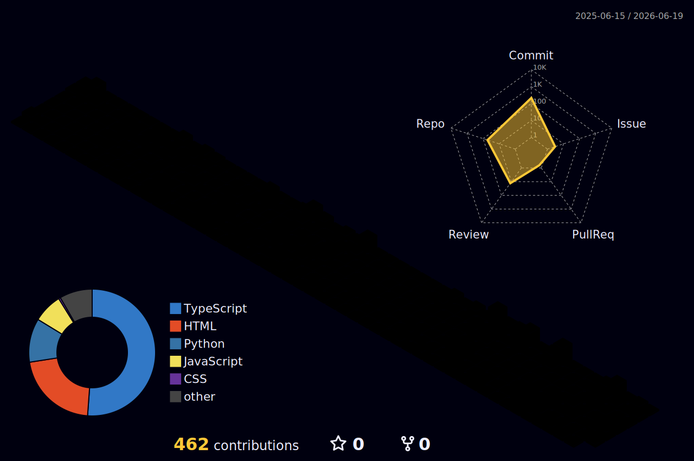

<div align="center"><br/><br/><br/></div>---<table><tr><td width="58%" valign="top"># ABOUT MEI’m **Zain** — a business consultant building at the intersection of **AI, systems thinking, knowledge architecture, and digital operations**.My work is centered around one question:> **How do we turn scattered information into intelligent systems that compound over time?**I design frameworks, dashboards, workflows, and AI-powered operating systems that help people and organizations move from **noise** to **structure** to **execution**.</td><td width="42%" valign="top">```yamlidentity:  name: Zain  role: Business Consultant  archetype: AI Systems Architectmission:  - structure complexity  - automate repetitive work  - design scalable systems  - build intelligent workflowscurrent_mode:  - consulting  - AI experimentation  - second-brain design  - digital ecosystem building
</td>
</tr>
</table>

<div align="center">
OPERATING SYSTEM
</div>
<table>
<tr>
<td align="center" width="33%">
01 / THINK
Strategy, research, frameworks
Market analysis
Business models
Systems thinking
Decision maps
Root-cause analysis
</td>
<td align="center" width="33%">
02 / BUILD
AI tools, workflows, dashboards
Automations
Knowledge bases
Dashboards
Databases
Digital infrastructure
</td>
<td align="center" width="33%">
03 / SCALE
Content, consulting, operations
Client systems
Creator workflows
Agency operations
Community ecosystems
Repeatable playbooks
</td>
</tr>
</table>

<div align="center">
BUILD DOMAINS
</div>
<table>
<tr>
<td width="50%">
AI SYSTEMS


AI agents and copilots


Prompt systems


Workflow automation


AI-assisted research


Human + AI collaboration


SECOND BRAIN DESIGN


Personal knowledge management


Life operating systems


File and data architecture


Expandable project maps


Knowledge retrieval systems


</td>
<td width="50%">
CONSULTING INFRASTRUCTURE


Business process design


Operational audits


Client-facing dashboards


Strategy documentation


Scalable service delivery


CREATOR + AGENCY SYSTEMS


Content workflows


Brand positioning


Digital product systems


AI education media


Community building


</td>
</tr>
</table>

<div align="center">
TECH CONSTELLATION

<br/><br/>


</div>

<div align="center">
SIGNAL MAP
</div>


<div align="center">
GITHUB UNIVERSE


<br/>

</div>

<div align="center">
CONTRIBUTION MATRIX

<br/><br/>

</div>

<div align="center">
CURRENT QUESTLINE
</div>
<table>
<tr>
<td width="25%" align="center">
01
BUILD
AI-powered life infrastructure
</td>
<td width="25%" align="center">
02
MAP
Knowledge, tools, files, and systems
</td>
<td width="25%" align="center">
03
AUTOMATE
Repeatable business workflows
</td>
<td width="25%" align="center">
04
SCALE
Consulting, content, and community
</td>
</tr>
</table>

<div align="center">
CORE BELIEF

The future belongs to people who can transform complexity into systems.

<br/>

</div>

<div align="center">
CONNECT
<a href="https://linkedin.com/in/YOUR_LINK">
  
</a>
<a href="https://x.com/YOUR_HANDLE">
  
</a>
<a href="https://youtube.com/@YOUR_CHANNEL">
  
</a>
<a href="mailto:YOUR_EMAIL">
  
</a>
<br/><br/>

</div>
```
Replace every YOUR_USERNAME with your GitHub username.
