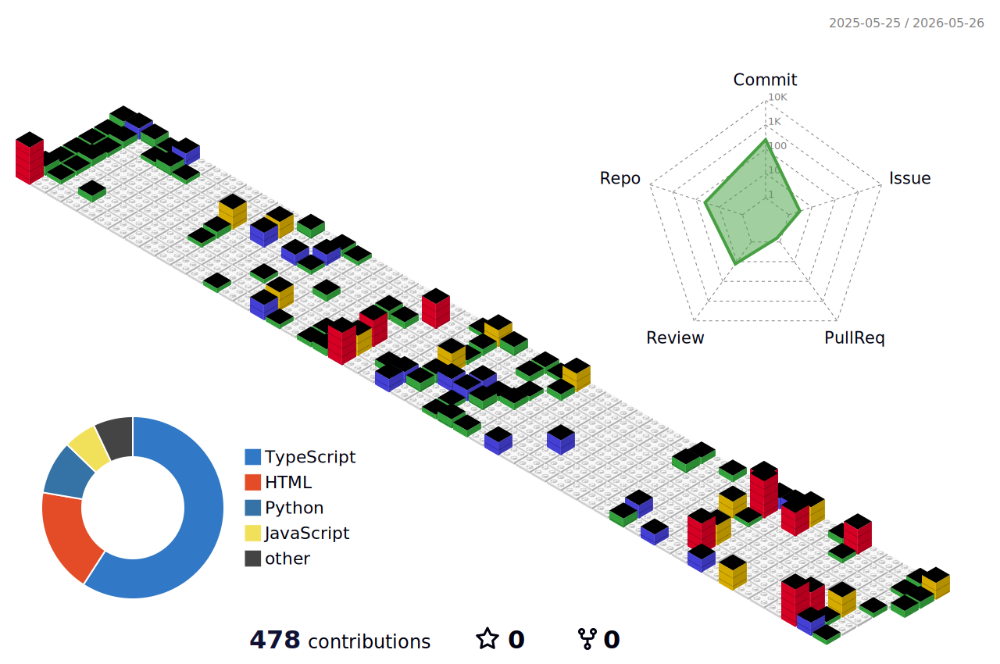

 

  

---

## ABOUT

I build simple systems that help people organize information, automate work, and turn ideas into action.

I focus on:

- AI workflows
- Knowledge systems
- Automation
- Consulting operations
- Digital infrastructure

---

## OPERATING SYSTEM

<table>
<tr>
<td width="33%" align="center">

<b>01 / THINK</b>  
Research 
Strategy 
Planning 
Problem solving 
Systems thinking

</td>
<td width="33%" align="center">

<b>02 / BUILD</b>  
AI tools 
Dashboards 
Automations 
Knowledge bases 
Workflows

</td>
<td width="33%" align="center">

<b>03 / SCALE</b>  
Operations 
Content systems 
Consulting systems 
Communities 
Growth systems

</td>
</tr>
</table>

---

## BUILD AREAS

<table>
<tr>
<td width="50%" valign="top">

<b>AI SYSTEMS</b>  
AI assistants 
Prompt systems 
Workflow automation 
AI research tools 
Human + AI collaboration  

<b>KNOWLEDGE SYSTEMS</b>  
Second brain design 
Personal knowledge management 
File organization 
Information systems 
Project mapping

</td>
<td width="50%" valign="top">

<b>CONSULTING SYSTEMS</b>  
Process design 
Operational workflows 
Client dashboards 
Strategy systems 
Scalable operations  

<b>CREATOR SYSTEMS</b>  
Content workflows 
Brand systems 
Digital products 
AI education 
Community systems

</td>
</tr>
</table>

---

## TECH STACK

  

---

## GITHUB STATS

  

---

## CONTRIBUTIONS

  

---

## CURRENT FOCUS

<table>
<tr>
<td width="25%" align="center">

<b>01</b>  
Building AI systems

</td>
<td width="25%" align="center">

<b>02</b>  
Organizing knowledge and tools

</td>
<td width="25%" align="center">

<b>03</b>  
Creating automation workflows

</td>
<td width="25%" align="center">

<b>04</b>  
Growing consulting and content systems

</td>
</tr>
</table>

---

## CONNECT

  

